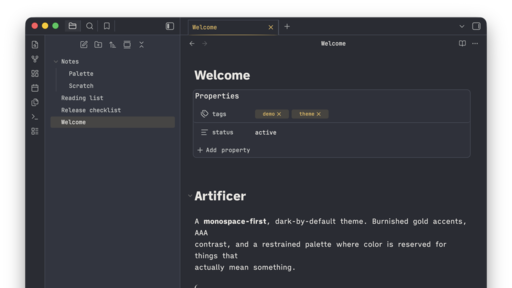

# Artificer for Obsidian

A monospace-first, dark-by-default Obsidian theme. Burnished gold accents, AAA
contrast, no rounded-corner softness, and a restrained palette of attention
colors. Includes a paper-cream light mode. The Obsidian embodiment of the
**Artificer design system** — a personal palette + type system that also drives
Ghostty, VS Code, and Claude Code.

## Install

### Via BRAT (beta reviewers' auto-update tool)

1. Install the **BRAT** community plugin in Obsidian.
2. BRAT → **Add beta theme** → `cameronsjo/artificer-obsidian`.
3. **Settings → Appearance → Themes** → select **Artificer**.

BRAT keeps the theme updated as new releases land.

### Manual

1. Download `theme.css` and `manifest.json` from the
   [latest release](https://github.com/cameronsjo/artificer-obsidian/releases/latest).
2. Drop both into `<your vault>/.obsidian/themes/Artificer/`.
3. **Settings → Appearance → Themes** → select **Artificer**.

`theme.css` is fully self-contained — the two typefaces are inlined, so there is
nothing else to download.

## Pair with Style Settings (recommended)

The theme exposes ~40 controls via the
[Style Settings](https://github.com/mgmeyers/obsidian-style-settings) plugin:
heading style, fonts, inactive-pane opacity, tab/tag style, all eight accent
colors (separate dark/light), code-block colors, texture, and whimsy. Without
Style Settings everything still works — you just get the defaults.

## Fonts

`theme.css` bundles **JetBrains Mono** and **iA Writer Quattro**, both under the
SIL Open Font License 1.1. Full license texts and copyrights: [FONTS.md](FONTS.md).

## License

The theme is **MIT** — see [LICENSE](LICENSE). Bundled fonts keep their own OFL
1.1 licenses — see [FONTS.md](FONTS.md).

---

Artificer v0.19.0 · part of Cameron's personal design system.
